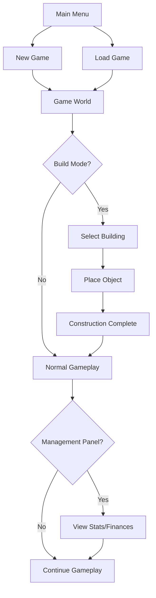

## 1. Product Overview
3D Ski Resort Tycoon is a strategic simulation game where players build and manage their own ski resort. Players design ski runs, construct lifts, manage finances, and satisfy visiting skiers to create a thriving winter destination.

The game combines 3D visualization with deep management mechanics, targeting simulation game enthusiasts who enjoy creative building and economic strategy. Players face challenges of terrain navigation, resource management, and guest satisfaction while building their dream ski resort.

## 2. Core Features

### 2.1 User Roles
| Role | Registration Method | Core Permissions |
|------|---------------------|------------------|
| Player | Single-player game | Full access to all game features |

### 2.2 Feature Module
The game consists of the following main screens:
1. **Main Menu**: Game startup, new/load game options, settings access
2. **Game World**: 3D resort view with camera controls, terrain visualization
3. **Build Mode**: Object placement interface, building selection, construction tools
4. **Management Panel**: Financial overview, resort statistics, guest satisfaction
5. **Pause Menu**: Game pause, save/load options, return to main menu

### 2.3 Page Details
| Page Name | Module Name | Feature description |
|-----------|-------------|---------------------|
| Main Menu | Game Start | Display game logo, background mountain scene, new game button, load game button, settings button, exit button |
| Game World | 3D Camera System | WASD/arrow key panning, mouse scroll zoom, fixed 60° tilt angle, 45° rotation for optimal viewing, smooth camera transitions |
| Game World | Terrain Rendering | 3D mountain terrain with elevation changes, snow textures, tree placement, realistic lighting and shadows |
| Game World | NPC System | Spawn skiers with different skill levels, pathfinding along ski runs, visual variety in appearance, realistic skiing animations |
| Build Mode | Object Placement | Select buildings/lifts from menu, preview placement on terrain, snap-to-grid system, collision detection, resource cost display |
| Build Mode | Piste System | Node-based path drawing tool, connect nodes to create ski runs, difficulty rating calculation (green/blue/black), slope angle visualization |
| Build Mode | Lift System | Chairlift placement with start/end stations, moving chair visualization, capacity settings, queue management |
| Management Panel | Economy System | Display current money, daily income/expenses, building maintenance costs, lift ticket revenue, guest satisfaction metrics |
| Management Panel | Resort Statistics | Total skiers served, average satisfaction rating, resort reputation, number of runs/lifts, terrain coverage percentage |
| UI/HUD | Game Interface | Money display, build mode toggle button, management panel button, speed controls (pause/normal/fast), mini-map overview |

## 3. Core Process
**Player Flow:**
1. Start new game → Generate mountain terrain → Begin with starter money
2. Enter build mode → Place initial ski lift → Create connecting ski runs
3. Open resort → NPC skiers arrive and use facilities → Earn money from ticket sales
4. Monitor guest satisfaction → Expand resort with new runs and facilities → Increase prices strategically
5. Manage finances → Balance construction costs with revenue → Build reputation to attract more guests

**Build Mode Flow:**
Enter build mode → Select building type → Hover over terrain for placement preview → Click to confirm placement → Deduct money from funds → Construction completes instantly

**Piste Creation Flow:**
Select piste tool → Click to place first node → Continue clicking to create path → Right-click to finish → System calculates difficulty rating → Piste becomes active for skiers

## 4. User Interface Design

### 4.1 Design Style
- **Primary Colors**: Deep blue (#1e3a8a) for UI panels, white (#ffffff) for snow/background, green (#16a34a) for money/success indicators
- **Secondary Colors**: Gray (#6b7280) for UI backgrounds, red (#dc2626) for warnings/errors, gold (#f59e0b) for premium features
- **Button Style**: Rounded corners (8px radius), subtle shadows, hover effects with color transitions
- **Font**: Clean sans-serif (system fonts), 14px for body text, 18px for headers, 12px for small details
- **Layout Style**: Card-based UI panels with transparency, floating elements over 3D world, minimal visual obstruction
- **Icon Style**: Simple line icons, winter/ski theme, consistent 2px stroke width

### 4.2 Page Design Overview
| Page Name | Module Name | UI Elements |
|-----------|-------------|-------------|
| Main Menu | Background | Animated 3D mountain scene with falling snow, subtle camera movement, winter color palette |
| Main Menu | Menu Buttons | Centered vertical layout, large friendly buttons (200px wide), hover scaling effects, winter-themed button styling |
| Game World | HUD Top Bar | Semi-transparent bar across top, money counter left side, speed controls center, menu buttons right side |
| Game World | Build Mode Panel | Slide-out panel from right side, categorized building tabs, grid layout for building options, cost labels below each item |
| Game World | Management Button | Floating button bottom-right, opens slide-up panel, subtle pulse animation when notifications pending |
| Build Mode | Placement Preview | Green/red ghost object showing valid/invalid placement, follows mouse cursor, snaps to terrain grid |
| Management Panel | Statistics Grid | Card-based layout for different stat categories, progress bars for satisfaction ratings, line graphs for financial trends |

### 4.3 Responsiveness
- Desktop-first design optimized for 1920x1080 resolution
- Minimum supported resolution: 1366x768
- UI scales appropriately for different screen sizes
- Touch interaction not required (keyboard/mouse focused)
- Camera controls optimized for desktop gaming experience