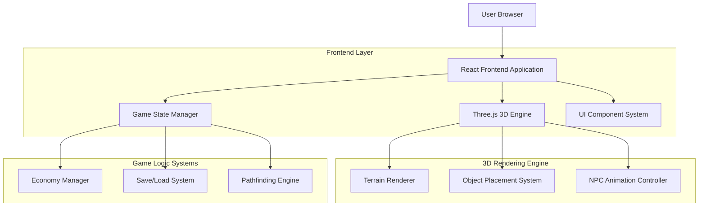
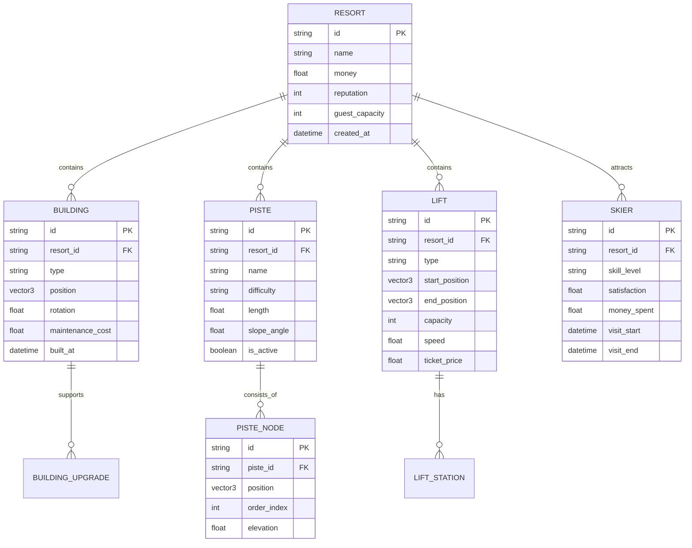

## 1. Architecture design



## 2. Technology Description

- Frontend: React@18 + Three.js@0.158 + Vite@4
- State Management: Zustand@4 for game state, React state for UI
- 3D Graphics: Three.js with WebGL renderer, custom shaders for snow effects
- Physics: Built-in Three.js raycasting for terrain collision, custom slope calculations
- Build Tool: Vite for fast development and optimized production builds
- Package Manager: npm with lockfile for dependency consistency

## 3. Route definitions

| Route | Purpose |
|-------|---------|
| / | Main menu, game entry point with new/load game options |
| /game | Main game world with 3D resort view and camera controls |
| /settings | Game configuration options, graphics settings, audio controls |

## 4. Component Architecture

### 4.1 Core 3D Components

**ThreeScene Component**
```typescript
interface ThreeSceneProps {
  camera: PerspectiveCamera;
  renderer: WebGLRenderer;
  onMount: (scene: Scene) => void;
}
```

**TerrainMesh Component**
```typescript
interface TerrainMeshProps {
  width: number;
  height: number;
  elevationData: number[][];
  snowTexture: Texture;
}
```

**BuildingPlacement Component**
```typescript
interface BuildingPlacementProps {
  buildingType: BuildingType;
  position: Vector3;
  isValid: boolean;
  onPlace: (position: Vector3) => void;
}
```

### 4.2 Game Logic Components

**EconomyManager**
```typescript
interface EconomyState {
  currentMoney: number;
  dailyRevenue: number;
  dailyExpenses: number;
  guestSatisfaction: number;
}

interface EconomyActions {
  addRevenue: (amount: number) => void;
  addExpense: (amount: number) => void;
  updateSatisfaction: (rating: number) => void;
}
```

**NPCManager**
```typescript
interface SkierNPC {
  id: string;
  position: Vector3;
  skillLevel: 'beginner' | 'intermediate' | 'expert';
  currentRun: PistePath | null;
  satisfaction: number;
}

interface NPCManagerState {
  activeSkiers: SkierNPC[];
  spawnRate: number;
  maxCapacity: number;
}
```

## 5. Data Model

### 5.1 Game World Entities



### 5.2 Data Definition Language

**Resort Table**
```sql
CREATE TABLE resorts (
    id UUID PRIMARY KEY DEFAULT gen_random_uuid(),
    name VARCHAR(255) NOT NULL,
    money DECIMAL(12, 2) DEFAULT 100000.00,
    reputation INTEGER DEFAULT 50,
    guest_capacity INTEGER DEFAULT 100,
    created_at TIMESTAMP WITH TIME ZONE DEFAULT NOW(),
    updated_at TIMESTAMP WITH TIME ZONE DEFAULT NOW()
);
```

**Buildings Table**
```sql
CREATE TABLE buildings (
    id UUID PRIMARY KEY DEFAULT gen_random_uuid(),
    resort_id UUID REFERENCES resorts(id) ON DELETE CASCADE,
    type VARCHAR(50) NOT NULL,
    position_x DECIMAL(10, 2) NOT NULL,
    position_y DECIMAL(10, 2) NOT NULL,
    position_z DECIMAL(10, 2) NOT NULL,
    rotation DECIMAL(5, 2) DEFAULT 0.00,
    maintenance_cost DECIMAL(8, 2) NOT NULL,
    built_at TIMESTAMP WITH TIME ZONE DEFAULT NOW()
);
```

**Pistes Table**
```sql
CREATE TABLE pistes (
    id UUID PRIMARY KEY DEFAULT gen_random_uuid(),
    resort_id UUID REFERENCES resorts(id) ON DELETE CASCADE,
    name VARCHAR(255) NOT NULL,
    difficulty VARCHAR(20) CHECK (difficulty IN ('green', 'blue', 'black')),
    length DECIMAL(8, 2) NOT NULL,
    slope_angle DECIMAL(5, 2) NOT NULL,
    is_active BOOLEAN DEFAULT true,
    created_at TIMESTAMP WITH TIME ZONE DEFAULT NOW()
);
```

## 6. 3D Rendering Pipeline

### 6.1 Terrain Generation
```typescript
class TerrainGenerator {
  generateTerrain(width: number, height: number, seed: number): TerrainData {
    // Perlin noise for elevation
    // Voronoi diagrams for ski run areas
    // Slope calculation for difficulty ratings
  }
  
  createMesh(terrainData: TerrainData): Mesh {
    // Three.js PlaneGeometry with displacement mapping
    // Custom vertex shader for snow effects
    // Texture blending for different terrain types
  }
}
```

### 6.2 Object Placement System
```typescript
class PlacementSystem {
  raycastToTerrain(mousePosition: Vector2): Vector3 {
    // Three.js Raycaster for terrain intersection
    // Snap to grid system (2m x 2m cells)
    // Slope validation for building placement
  }
  
  validatePlacement(position: Vector3, objectType: BuildingType): boolean {
    // Check terrain slope angle
    // Check collision with existing objects
    // Check proximity to ski runs
  }
}
```

### 6.3 NPC Animation Controller
```typescript
class NPCAnimationController {
  updateSkierMovement(skier: SkierNPC, deltaTime: number): void {
    // Pathfinding along piste nodes
    // Speed based on skill level and slope angle
    // Turning animations based on path curvature
  }
  
  calculatePath(from: Vector3, to: Vector3, piste: PistePath): Vector3[] {
    // A* pathfinding algorithm
    // Follow piste node connections
    // Avoid obstacles and other skiers
  }
}
```

## 7. State Management Architecture

### 7.1 Game State Store (Zustand)
```typescript
interface GameState {
  // World State
  currentResort: Resort | null;
  terrainData: TerrainData | null;
  
  // UI State
  isBuildMode: boolean;
  selectedBuilding: BuildingType | null;
  cameraPosition: Vector3;
  
  // Game Logic
  economy: EconomyState;
  activeSkiers: SkierNPC[];
  
  // Actions
  placeBuilding: (type: BuildingType, position: Vector3) => void;
  createPiste: (nodes: Vector3[]) => void;
  updateEconomy: () => void;
  saveGame: () => void;
  loadGame: (saveData: SaveData) => void;
}
```

### 7.2 Save System
```typescript
interface SaveData {
  resort: Resort;
  buildings: Building[];
  pistes: Piste[];
  lifts: Lift[];
  terrainSeed: number;
  timestamp: number;
}

class SaveSystem {
  serializeGameState(state: GameState): SaveData {
    // Convert Three.js objects to serializable data
    // Compress large datasets (terrain, paths)
    // Include version number for compatibility
  }
  
  deserializeSaveData(data: SaveData): GameState {
    // Recreate Three.js objects from saved data
    // Validate data integrity
    // Handle version migrations
  }
}
```

## 8. Performance Optimization

### 8.1 Rendering Optimizations
- **LOD (Level of Detail)**: Reduce mesh complexity for distant objects
- **Frustum Culling**: Only render objects visible to camera
- **Instanced Rendering**: Batch render similar objects (trees, chairs)
- **Texture Atlasing**: Combine multiple textures into single atlas
- **Occlusion Culling**: Skip rendering objects behind mountains

### 8.2 Memory Management
- **Object Pooling**: Reuse NPC objects instead of creating/destroying
- **Geometry Disposal**: Properly clean up Three.js geometries
- **Texture Management**: Load textures on-demand, implement caching
- **State Cleanup**: Clear unused game state periodically

### 8.3 Update Optimizations
- **Fixed Timestep**: Consistent physics updates independent of frame rate
- **Spatial Partitioning**: Grid-based system for NPC collision detection
- **Lazy Updates**: Only update visible NPCs and active systems
- **Background Processing**: Offload heavy calculations to Web Workers